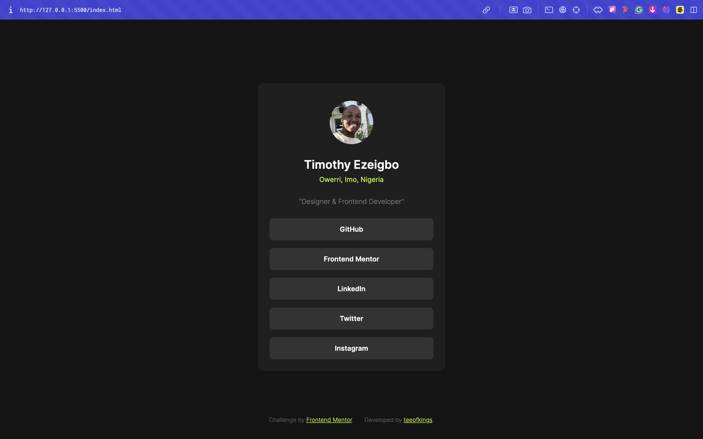

# Frontend Mentor - Social links profile solution

This is a solution to the [Social links profile challenge on Frontend Mentor](https://www.frontendmentor.io/challenges/social-links-profile-UG32l9m6dQ). Frontend Mentor challenges help you improve your coding skills by building realistic projects. 

## Table of contents

- [Overview](#overview)
  - [The challenge](#the-challenge)
  - [Screenshot](#screenshot)
  - [Links](#links)
- [My process](#my-process)
  - [Built with](#built-with)
  - [What I learned](#what-i-learned)
  - [Continued development](#continued-development)
- [Author](#author)


## Overview

### The challenge

Users should be able to:

- See hover and focus states for all interactive elements on the page

### Screenshot




### Links

- Solution URL: (https://your-solution-url.com)
- Live Site URL: (https://social-links-profile-omega-drab.vercel.app/)


## My process

### Built with

- HTML
- CSS


### What I learned

This time i learned a lot 
- How to make use of 
```css 
clamp()
```
- How to make create and make use of css variables
- How to create responsive designs without have so many breakpoints
- Deeper knowledge of selectors
- How to create for mobile-first compatibilty


### Continued development

I want to grow and try my hands on bigger projects
Little by little, Component by Components
I will become the standard!


## Author

- Website - [Timothy Ezeigbo]
- Frontend Mentor - [@Teeofkings](https://www.frontendmentor.io/profile/teeofkings)
- Twitter - [@teeofkings](https://www.twitter.com/teeofkings)

